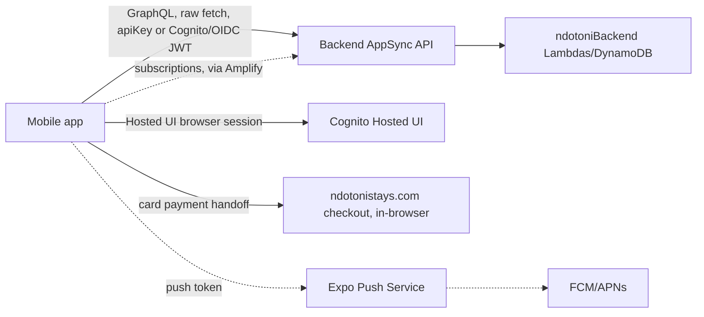

# Ndotoni App — Documentation Index

Expo/React Native mobile app for Ndotoni Stays (short-term/Airbnb-style bookings). This
doc set is for engineers and AI agents who need to understand or debug this codebase
without re-deriving it from scratch.

For local setup (install, env vars, running, building), see the
[root README](../README.md). This index is about how the app works.

**A note on this doc set**: this repo previously had ~85 scattered markdown files across
a `documentation/` folder, a near-duplicate `documentations/` folder, and duplicate
`app-review-notes.md`/`.txt` files — almost all "we just finished implementing X"
progress logs, several actively describing an auth approach that was later reverted and
then re-implemented a third way, and one (`ENVIRONMENT_VARIABLES.md`) listing env var
names that don't exist in the actual code. All were verified against current source
before being deleted and replaced with this set. If you find a claim here that no longer
matches the code, trust the code and fix the doc — the same discipline that produced this
rewrite.

## Documentation map

| Doc | Read it when you need to... |
|---|---|
| [architecture.md](./architecture.md) | Understand the tech stack, the full screen/route map, and what's dead code vs. live. |
| [graphql-and-codegen.md](./graphql-and-codegen.md) | Add/change a GraphQL call, or regenerate types after a backend schema change. |
| [auth.md](./auth.md) | Work on sign-in/sign-up — this app's auth is genuinely more complex than the web apps' (hybrid Amplify + hand-rolled OIDC). |
| [push-notifications.md](./push-notifications.md) | Work on push notifications for chat or booking events. |
| [booking-and-payment.md](./booking-and-payment.md) | Work on the booking flow, mobile-money payment, or the card-payment web handoff. |

## The 60-second mental model

1. **This app is the short-term-stays companion app, not a dual-product app.** There is
   no long-term-rental UI — only `RentalType.SHORT_TERM` exists as a real code path (a
   `LONG_TERM` branch exists in a couple of files but is unreachable/vestigial). Don't be
   misled by the repo name `ndotoniApp` or the package.json name `ndotoni-stays` pointing
   in different directions — functionally, it's the Stays app.
2. **Auth is genuinely hybrid**, and for a real reason: email/password goes through
   Amplify/Cognito directly; Google/Facebook/Apple sign-in uses a **hand-rolled OIDC
   authorization-code flow** (`expo-web-browser` + manual token exchange) because
   Amplify's built-in `signInWithRedirect` was unreliable in React Native. See
   [auth.md](./auth.md) — and note there's a fully dead older auth implementation
   (`lib/auth-bridge.ts`) still sitting in the repo, imported by nothing.
3. **GraphQL queries/mutations bypass Amplify's client** — a custom `fetch()`-based
   `GraphQLClient` handles those, while **subscriptions do go through Amplify's
   `generateClient()`**. Two different mechanisms for two different operation types. See
   [graphql-and-codegen.md](./graphql-and-codegen.md).
4. **Card payments are not handled natively.** There's no Stripe SDK in this app — card
   payment hands off to the `ndotonistays.com` web checkout in the system browser, with
   an `AppState`-based re-check when the user returns to the app. Mobile money is fully
   in-app (phone number → poll for confirmation). See
   [booking-and-payment.md](./booking-and-payment.md).
5. **Two release mechanisms, triggered differently**: OTA JS updates ship automatically
   on every push to `main`; native store builds only happen when you push a `v*` tag. See
   [deployment](#deployment) below.

## Deployment

- **`.github/workflows/ci.yml`** — on PR/push to `main`: install, `type-check`, `lint`,
  `expo-doctor`. No build/deploy.
- **`.github/workflows/eas-update.yml`** — on push to `main`: `eas update --branch
  production --platform ios/android` — ships an **over-the-air JS update** immediately to
  everyone with the app installed. This is the default release path for any JS-only
  change.
- **`.github/workflows/eas-build.yml`** — on pushing a `v*` git tag: `eas build --profile
  production` + `eas submit --profile production --latest` for both iOS and Android —
  full native builds submitted to the App Store / Play Store. Only needed when native
  code/config changed (new permission, new native module, `app.config.ts` edit) — a
  JS-only change doesn't need this and should ship via OTA instead.

`eas.json` build profiles: `development` (dev client), `preview` (internal
Android APK + iOS non-simulator build, channel `preview`), `production` (app-bundle/Release,
channel `production`, `autoIncrement: true`).
